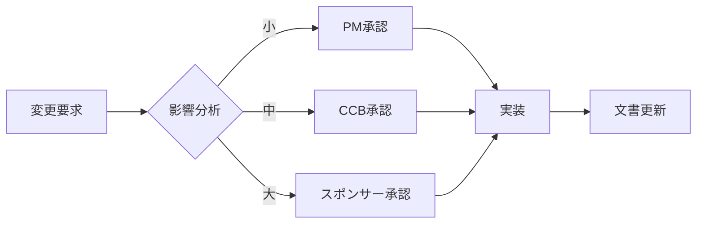
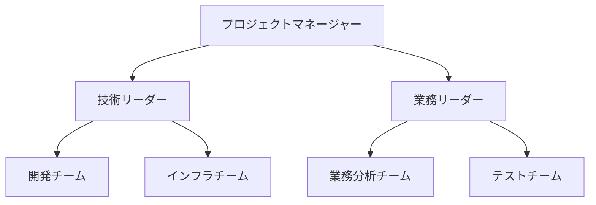
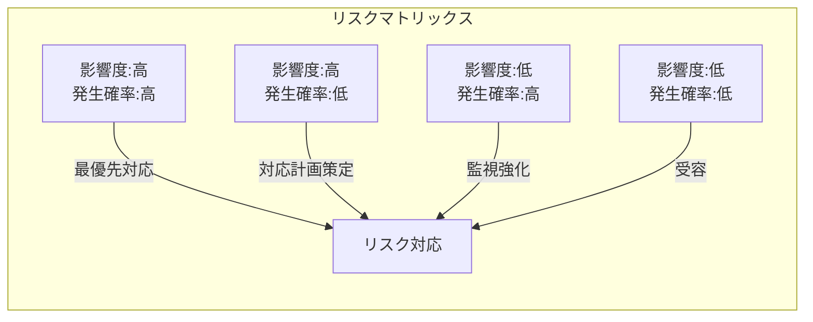

# プロジェクトマネジメント計画書

> **重要**: これは「生きた文書」です。プロジェクトの進行に応じて更新してください。

## 文書管理情報

| 項目 | 内容 |
|------|------|
| プロジェクト名 | [プロジェクト名] |
| 文書バージョン | 1.0 |
| 最終更新日 | [YYYY/MM/DD] |
| 次回レビュー予定日 | [YYYY/MM/DD] |

## 変更履歴

| バージョン | 日付 | 変更内容 | 変更者 |
|-----------|------|----------|--------|
| 1.0 | [YYYY/MM/DD] | 初版作成 | [氏名] |

---

## 1. プロジェクトライフサイクルとアプローチ

### 選択したライフサイクル
- [ ] 予測型（ウォーターフォール）
- [ ] 反復型（イテレーティブ）
- [ ] 適応型（アジャイル）
- [ ] ハイブリッド

### 開発アプローチの詳細
[選択した理由と具体的な進め方を記載]

### フェーズゲート基準

| フェーズ | 完了基準 | 承認者 |
|---------|----------|--------|
| 計画フェーズ | ・全計画書の承認 ・予算の確保 ・チーム編成完了 | [承認者] |
| 実行フェーズ | ・成果物の完成 ・品質基準の達成 ・受入テスト合格 | [承認者] |
| 終結フェーズ | ・引き渡し完了 ・教訓の文書化 ・リソースの解放 | [承認者] |

---

## 2. スコープマネジメント計画

### スコープ定義プロセス
1. 要求事項収集の方法: [インタビュー、ワークショップ等]
2. スコープ記述書の作成責任者: [氏名/役割]
3. WBS作成の参加者: [参加者リスト]

### スコープ変更管理

### スコープ検証の方法
- 検証の頻度: [週次/月次/マイルストーン毎]
- 検証の参加者: [参加者]
- 承認プロセス: [プロセス詳細]

---

## 3. スケジュールマネジメント計画

### スケジュール作成方法
- 使用ツール: [MS Project、Excel等]
- アクティビティ定義の詳細度: [作業パッケージレベル]
- 見積手法: [類推見積、パラメトリック見積等]

### バッファー管理
- プロジェクトバッファー: 全体工期の[X]%
- フィーディングバッファー: 各クリティカルチェーンの[Y]%

### 進捗管理
- 報告頻度: [日次/週次]
- 使用する指標: [EVM、完了率、マイルストーン達成率]
- 遅延時のエスカレーション基準: [X日以上の遅延]

---

## 4. コストマネジメント計画

### コスト見積方法
- 見積手法: [ボトムアップ、トップダウン等]
- 予備費の設定: 
  - コンティンジェンシー予備: [X]%
  - マネジメント予備: [Y]%

### コスト管理基準

| 項目 | 基準値 | アクション |
|------|--------|------------|
| CV（コスト差異） | -5%以内 | 継続監視 |
| CV | -5%〜-10% | 是正措置検討 |
| CV | -10%超過 | エスカレーション |

### 予算承認権限

| 金額範囲 | 承認者 |
|----------|--------|
| 〜¥100万 | プロジェクトマネージャー |
| ¥100万〜¥500万 | 部門長 |
| ¥500万以上 | スポンサー |

---

## 5. 品質マネジメント計画

### 品質基準

| 成果物 | 品質基準 | 測定方法 |
|--------|----------|----------|
| [成果物1] | [具体的基準] | [測定方法] |
| [成果物2] | [具体的基準] | [測定方法] |

### 品質保証活動
- プロセス監査: [頻度]
- ピアレビュー: [対象と頻度]
- 外部監査: [必要に応じて]

### 品質管理手法
- [ ] チェックリスト
- [ ] 統計的サンプリング
- [ ] テスト自動化
- [ ] その他: [詳細]

---

## 6. リソースマネジメント計画

### チーム編成

### 役割と責任（RACI）

| タスク | PM | 技術リーダー | 業務リーダー | スポンサー |
|--------|-----|-------------|-------------|------------|
| 要件定義 | A | R | C | I |
| 設計 | A | R | C | I |
| 開発 | I | R | C | I |
| テスト | I | C | R | I |

*R=実行責任、A=説明責任、C=相談、I=情報共有*

### リソース調達計画
- 内部リソース: [調達方法とタイミング]
- 外部リソース: [調達基準と手続き]

---

## 7. コミュニケーションマネジメント計画

### コミュニケーションマトリックス

| 情報 | 送信者 | 受信者 | 頻度 | 方法 | 目的 |
|------|--------|--------|------|------|------|
| 進捗報告 | PM | スポンサー | 週次 | 会議 | 意思決定 |
| 技術課題 | 技術リーダー | PM | 随時 | メール/Slack | 情報共有 |
| 変更要求 | 誰でも | CCB | 随時 | 申請書 | 承認取得 |

### 会議体系

| 会議名 | 頻度 | 参加者 | 所要時間 |
|--------|------|--------|----------|
| ステアリングコミッティ | 月次 | スポンサー、PM、主要SH | 60分 |
| 進捗会議 | 週次 | PM、チームリーダー | 30分 |
| デイリースタンドアップ | 日次 | 開発チーム全員 | 15分 |

---

## 8. リスクマネジメント計画

### リスク識別方法
- ブレーンストーミング: [実施タイミング]
- チェックリスト分析: [使用するチェックリスト]
- SWOT分析: [実施タイミング]

### リスク分析基準

### リスク対応戦略
- 回避: [基準と方法]
- 軽減: [基準と方法]
- 転嫁: [基準と方法]
- 受容: [基準と方法]

---

## 9. 調達マネジメント計画

### 調達方針
- 内外製判断基準: [基準詳細]
- ベンダー選定基準: [評価項目と配点]
- 契約タイプ: [定額、実費精算等]

### 調達スケジュール

| 調達項目 | RFP発行 | 提案締切 | 選定完了 | 契約締結 |
|----------|---------|----------|----------|----------|
| [項目1] | [日付] | [日付] | [日付] | [日付] |
| [項目2] | [日付] | [日付] | [日付] | [日付] |

---

## 10. ステークホルダーマネジメント計画

### エンゲージメント戦略

| ステークホルダー | 現在の態度 | 望ましい態度 | 戦略 |
|-----------------|------------|-------------|------|
| [SH1] | 抵抗的/中立/支援的 | 支援的 | [具体的戦略] |
| [SH2] | 抵抗的/中立/支援的 | 支援的 | [具体的戦略] |

### ステークホルダー管理アプローチ
- 高影響力・高関心: [密接に管理]
- 高影響力・低関心: [満足度維持]
- 低影響力・高関心: [十分な情報提供]
- 低影響力・低関心: [最小限の管理]

---

## 11. 変更管理計画

### 変更管理プロセス

1. **変更要求の提出**
   - 使用フォーム: [フォーム名/番号]
   - 提出先: [提出先]

2. **影響分析**
   - 分析項目: スコープ、スケジュール、コスト、品質、リスク
   - 分析責任者: [役割/氏名]

3. **承認プロセス**
   - CCB開催: [頻度]
   - 緊急変更手続き: [手続き詳細]

4. **実装と追跡**
   - 変更の実装管理: [方法]
   - 変更ログの管理: [ツール/方法]

---

## 12. プロジェクト終結基準

### 終結条件
- [ ] すべての成果物の引き渡し完了
- [ ] 契約上の義務の履行
- [ ] 最終支払いの完了
- [ ] プロジェクト文書のアーカイブ
- [ ] 教訓の文書化と共有
- [ ] チームメンバーの解放
- [ ] 最終報告書の提出

### 移行計画
- 運用への引き継ぎ: [計画詳細]
- サポート体制: [期間と体制]
- 保証期間: [期間と条件]

---

### 使用上の注意
- この計画書は「一度作って終わり」ではありません
- プロジェクトの状況に応じて継続的に更新してください
- すべてのセクションを埋める必要はありません（プロジェクトに応じて選択）
- 小規模プロジェクトでは、重要な項目のみに絞って使用してください