# WBS（作業分解構造）テンプレート

> **重要**: WBSは「何を作るか」を示すもので、「どうやって作るか」ではありません！成果物に焦点を当てましょう。

## WBS基本情報

| 項目 | 内容 |
|------|------|
| プロジェクト名 | [プロジェクト名] |
| WBSバージョン | 1.0 |
| 作成日 | [YYYY/MM/DD] |
| 作成者 | [氏名] |
| 最終更新日 | [YYYY/MM/DD] |

## WBS作成のルール

### 100%ルール
- 親要素 = 子要素の合計（必ず100%）
- 余分なものも、不足もない

### 分解の基準
- [ ] 8/80ルール（8時間以上、80時間以下）
- [ ] レポート期間ルール（1〜2レポート期間内）
- [ ] その他: [具体的な基準]

---

## WBS階層構造（ビジュアル版）

```mermaid
graph TD
    A[1.0 プロジェクト名] --> B[1.1 プロジェクトマネジメント]
    A --> C[1.2 要件定義]
    A --> D[1.3 設計]
    A --> E[1.4 開発]
    A --> F[1.5 テスト]
    A --> G[1.6 移行]
    
    B --> B1[1.1.1 計画書作成]
    B --> B2[1.1.2 進捗管理]
    B --> B3[1.1.3 変更管理]
    B --> B4[1.1.4 終結活動]
    
    C --> C1[1.2.1 現状分析]
    C --> C2[1.2.2 要件収集]
    C --> C3[1.2.3 要件定義書]
    C --> C4[1.2.4 要件承認]
    
    D --> D1[1.3.1 基本設計]
    D --> D2[1.3.2 詳細設計]
    D --> D3[1.3.3 設計レビュー]
    
    E --> E1[1.4.1 環境構築]
    E --> E2[1.4.2 機能開発]
    E --> E3[1.4.3 統合]
    
    F --> F1[1.5.1 テスト計画]
    F --> F2[1.5.2 テスト実施]
    F --> F3[1.5.3 不具合対応]
    F --> F4[1.5.4 受入テスト]
    
    G --> G1[1.6.1 移行計画]
    G --> G2[1.6.2 データ移行]
    G --> G3[1.6.3 本番移行]
    G --> G4[1.6.4 並行稼働]
```



---

## WBS辞書形式

### 1.0 [プロジェクト名]
*プロジェクト全体*

### 1.1 プロジェクトマネジメント

| WBS番号 | 成果物名 | 成果物の説明 | 受入基準 | 責任者 |
|---------|----------|--------------|----------|--------|
| 1.1.1 | 計画書作成 | 全マネジメント計画書 | ・承認取得<br>・ベースライン設定 | PM |
| 1.1.2 | 進捗管理 | 進捗報告書、EVM分析 | ・週次報告完了<br>・偏差分析実施 | PM |
| 1.1.3 | 変更管理 | 変更ログ、更新文書 | ・CCB承認<br>・文書更新完了 | PM |
| 1.1.4 | 終結活動 | 最終報告書、教訓 | ・承認取得<br>・アーカイブ完了 | PM |

### 1.2 要件定義

| WBS番号 | 成果物名 | 成果物の説明 | 受入基準 | 責任者 |
|---------|----------|--------------|----------|--------|
| 1.2.1 | 現状分析 | 現状業務フロー、課題一覧 | ・ヒアリング完了<br>・文書化完了 | BA |
| 1.2.2 | 要件収集 | 要件一覧、優先順位 | ・全SH確認<br>・優先度合意 | BA |
| 1.2.3 | 要件定義書 | 機能/非機能要件定義書 | ・レビュー完了<br>・トレーサビリティ確立 | BA |
| 1.2.4 | 要件承認 | 承認済み要件定義書 | ・全SH承認<br>・ベースライン設定 | BA |

### 1.3 設計

| WBS番号 | 成果物名 | 成果物の説明 | 受入基準 | 責任者 |
|---------|----------|--------------|----------|--------|
| 1.3.1 | 基本設計 | アーキテクチャ設計書 | ・技術選定完了<br>・方式確定 | アーキテクト |
| 1.3.2 | 詳細設計 | 画面/機能/DB設計書 | ・全機能網羅<br>・レビュー完了 | 設計者 |
| 1.3.3 | 設計レビュー | レビュー記録、改善点 | ・指摘事項対応<br>・承認取得 | 技術リーダー |

### 1.4 開発

| WBS番号 | 成果物名 | 成果物の説明 | 受入基準 | 責任者 |
|---------|----------|--------------|----------|--------|
| 1.4.1 | 環境構築 | 開発/テスト環境 | ・全員アクセス可<br>・CI/CD設定完了 | インフラ |
| 1.4.2 | 機能開発 | プログラムコード | ・コーディング規約準拠<br>・単体テスト完了 | 開発者 |
| 1.4.3 | 統合 | 統合済みシステム | ・ビルド成功<br>・結合テスト完了 | 技術リーダー |

### 1.5 テスト

| WBS番号 | 成果物名 | 成果物の説明 | 受入基準 | 責任者 |
|---------|----------|--------------|----------|--------|
| 1.5.1 | テスト計画 | テスト計画書、ケース | ・要件網羅<br>・承認取得 | QAリーダー |
| 1.5.2 | テスト実施 | テスト結果、証跡 | ・全ケース実施<br>・合格率基準達成 | テスター |
| 1.5.3 | 不具合対応 | 修正済みコード | ・重大度高の解決<br>・回帰テスト完了 | 開発者 |
| 1.5.4 | 受入テスト | 受入証明書 | ・ユーザー確認完了<br>・サインオフ取得 | ユーザー |

### 1.6 移行

| WBS番号 | 成果物名 | 成果物の説明 | 受入基準 | 責任者 |
|---------|----------|--------------|----------|--------|
| 1.6.1 | 移行計画 | 移行計画書、手順書 | ・リスク対策完了<br>・承認取得 | PM |
| 1.6.2 | データ移行 | 移行済みデータ | ・整合性確認<br>・性能基準達成 | DBA |
| 1.6.3 | 本番移行 | 本番稼働システム | ・切替完了<br>・動作確認OK | インフラ |
| 1.6.4 | 並行稼働 | 運用引継ぎ文書 | ・マニュアル完成<br>・教育完了 | PM |

---

## ワークパッケージ詳細（記入例）

### WBS番号: 1.2.3 要件定義書

**成果物の詳細説明:**
システムの機能要件と非機能要件を明確に定義した文書

**作業内容:**
1. 収集した要件の整理と分類
2. 要件の詳細化と文書化
3. 要件間の依存関係の明確化
4. トレーサビリティマトリックスの作成

**必要なインプット:**
- 要件収集結果
- 現状分析結果
- 制約事項一覧

**作成する成果物:**
- 機能要件定義書
- 非機能要件定義書
- 要件トレーサビリティマトリックス

**所要期間:** 10営業日

**必要なリソース:**
- ビジネスアナリスト: 2名
- レビューア: 3名

**完了基準:**
- [ ] 全要件が SMART（具体的・測定可能・達成可能・関連性・期限）である
- [ ] ステークホルダーレビュー完了
- [ ] 要件の優先順位付け完了
- [ ] トレーサビリティ確立

---

## WBS作成のヒント

### やってはいけないこと ❌
- 「〜を管理する」「〜を調整する」などの継続的活動
- 「会議」「コミュニケーション」などの手段
- 組織構造（「営業部」「開発部」など）での分解

### やるべきこと ✅
- 成果物（名詞）で表現する
- 検証可能な完了基準を設定
- 重複や漏れがないか確認（100%ルール）
- チームで作成（一人で作らない）

### レベル設定の目安
- レベル1: プロジェクト全体
- レベル2: 主要な成果物群（フェーズ）
- レベル3: 個別の成果物
- レベル4: ワークパッケージ（これ以上分解しない）

---

### 補足: コントロールアカウント
予算とスケジュールの管理ポイントを設定する場合は、通常レベル2またはレベル3に設定します。

```
1.0 プロジェクト
  1.1 要件定義 ← コントロールアカウント
    1.1.1 現状分析
    1.1.2 要件収集
  1.2 設計 ← コントロールアカウント
    1.2.1 基本設計
    1.2.2 詳細設計
```