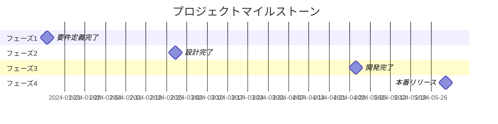
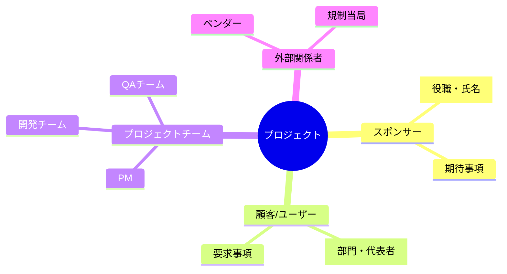

# プロジェクト憲章

> **重要**: これがないとプロジェクトは始まりません！プロジェクトマネージャーの権限の源泉となる文書です。

## プロジェクト基本情報

| 項目                     | 内容                     |
| ------------------------ | ------------------------ |
| プロジェクト名           | [プロジェクトの正式名称] |
| プロジェクト開始日       | [YYYY/MM/DD]             |
| プロジェクト終了予定日   | [YYYY/MM/DD]             |
| プロジェクトマネージャー | [氏名]                   |
| プロジェクトスポンサー   | [氏名・役職]             |
| 作成日                   | [YYYY/MM/DD]             |
| バージョン               | 1.0                      |

## 1. プロジェクトの目的とビジネス上の正当性

### なぜこのプロジェクトが必要か？

[ビジネス上の問題や機会を明確に記載]

### 期待される利益

- [ ] コスト削減: [具体的な数値目標]
- [ ] 収益増加: [具体的な数値目標]
- [ ] 効率改善: [具体的な改善指標]
- [ ] その他: [定性的な効果]

## 2. 測定可能なプロジェクト目標と成功基準

| 目標     | 成功基準           | 測定方法     |
| -------- | ------------------ | ------------ |
| [目標 1] | [具体的な数値目標] | [測定の手段] |
| [目標 2] | [具体的な数値目標] | [測定の手段] |
| [目標 3] | [具体的な数値目標] | [測定の手段] |

## 3. ハイレベル要求事項

### 必須要求事項（Must Have）

1. [要求事項 1]
2. [要求事項 2]
3. [要求事項 3]

### 希望要求事項（Nice to Have）

1. [要求事項 1]
2. [要求事項 2]

## 4. プロジェクトの概要説明

### スコープに含まれるもの

- [含まれる項目 1]
- [含まれる項目 2]
- [含まれる項目 3]

### スコープに含まれないもの（重要！）

- [含まれない項目 1]
- [含まれない項目 2]
- [含まれない項目 3]

## 5. 主要なマイルストーン

| マイルストーン     | 予定日       | 成果物   |
| ------------------ | ------------ | -------- |
| [マイルストーン 1] | [YYYY/MM/DD] | [成果物] |
| [マイルストーン 2] | [YYYY/MM/DD] | [成果物] |
| [マイルストーン 3] | [YYYY/MM/DD] | [成果物] |

## 6. 概算予算

| 費目                      | 金額        | 備考   |
| ------------------------- | ----------- | ------ |
| 人件費                    | ¥[金額]     | [内訳] |
| 外注費                    | ¥[金額]     | [内訳] |
| ハードウェア/ソフトウェア | ¥[金額]     | [内訳] |
| その他                    | ¥[金額]     | [内訳] |
| **合計**                  | **¥[総額]** |        |

## 7. ハイレベルリスク

| リスク     | 影響度   | 発生確率 | 初期対応策 |
| ---------- | -------- | -------- | ---------- |
| [リスク 1] | 高/中/低 | 高/中/低 | [対応策]   |
| [リスク 2] | 高/中/低 | 高/中/低 | [対応策]   |
| [リスク 3] | 高/中/低 | 高/中/低 | [対応策]   |

## 8. 主要ステークホルダー

| 役割         | 氏名/組織   | 期待事項   | 影響力 |
| ------------ | ----------- | ---------- | ------ |
| スポンサー   | [氏名]      | [期待事項] | 高     |
| 主要ユーザー | [氏名/部門] | [期待事項] | 高     |
| [その他]     | [氏名/組織] | [期待事項] | 中/低  |

## 9. プロジェクトマネージャーの権限

### 付与される権限

- [ ] 予算執行権限（上限: ¥[金額]）
- [ ] リソース調整権限
- [ ] 外部調達権限
- [ ] チームメンバーの評価権限

### 制約事項

- [制約 1]
- [制約 2]

## 10. 承認

| 役職                   | 氏名 | 署名 | 日付 |
| ---------------------- | ---- | ---- | ---- |
| プロジェクトスポンサー |      |      |      |
| 部門長                 |      |      |      |
| PMO                    |      |      |      |

---

### 記入のヒント

- **具体的に書く**: 「品質を向上させる」ではなく「不良率を現在の 3%から 1%以下にする」
- **測定可能にする**: すべての目標に数値目標を設定
- **スコープを明確に**: 含まれないものを明記することで、後のスコープクリープを防ぐ
- **リスクは正直に**: 初期段階で認識したリスクは隠さない
