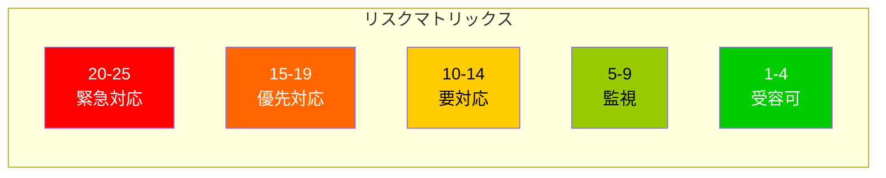
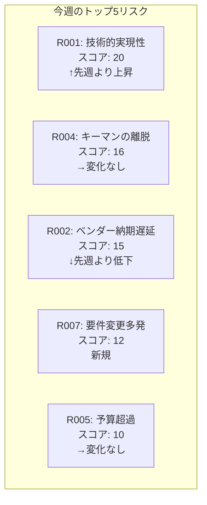

# リスク登録簿

> **重要**: リスクは「未来の不確実な事象」です。すでに起きていることは「課題（Issue）」として別管理してください。

## 文書情報

| 項目 | 内容 |
|------|------|
| プロジェクト名 | [プロジェクト名] |
| 最終更新日 | [YYYY/MM/DD] |
| 更新者 | [氏名] |
| レビュー頻度 | [週次/隔週] |

## リスク分析基準

### 発生確率の定義

| レベル | 確率 | 説明 |
|--------|------|------|
| 5 (非常に高い) | 80%以上 | ほぼ確実に発生する |
| 4 (高い) | 60-79% | 発生する可能性が高い |
| 3 (中) | 40-59% | 発生する可能性がある |
| 2 (低い) | 20-39% | 発生する可能性は低い |
| 1 (非常に低い) | 20%未満 | めったに発生しない |

### 影響度の定義

| レベル | コスト影響 | スケジュール影響 | 品質影響 |
|--------|-----------|----------------|----------|
| 5 (致命的) | 予算の20%超 | 2ヶ月以上の遅延 | 基幹機能が動作不能 |
| 4 (重大) | 予算の10-20% | 1-2ヶ月の遅延 | 主要機能に重大な欠陥 |
| 3 (中程度) | 予算の5-10% | 2-4週間の遅延 | 一部機能に影響 |
| 2 (軽微) | 予算の2-5% | 1-2週間の遅延 | 軽微な品質低下 |
| 1 (無視可能) | 予算の2%未満 | 1週間未満の遅延 | ほとんど影響なし |

### リスクスコア = 発生確率 × 影響度

---

## リスク登録簿

| ID | リスク名 | カテゴリ | 説明 | 原因 | 発生確率 | 影響度 | スコア | 対応戦略 | 対応策 | 責任者 | 期限 | ステータス | 更新日 |
|----|---------|----------|------|------|----------|--------|--------|----------|--------|--------|------|-----------|--------|
| R001 | [簡潔な名称] | 技術 | [リスクの詳細説明] | [根本原因] | 3 | 4 | 12 | 軽減 | [具体的対応策] | [氏名] | [日付] | 監視中 | [日付] |
| R002 | | スケジュール | | | | | | | | | | | |
| R003 | | コスト | | | | | | | | | | | |
| R004 | | 品質 | | | | | | | | | | | |
| R005 | | リソース | | | | | | | | | | | |
| R006 | | 外部 | | | | | | | | | | | |

### リスクカテゴリ
- **技術**: 技術的な実現可能性、複雑性
- **スケジュール**: 納期、マイルストーン
- **コスト**: 予算超過、為替変動
- **品質**: 品質基準未達、欠陥
- **リソース**: 要員不足、スキル不足
- **外部**: 法規制、市場変化、天災

### 対応戦略
- **回避**: リスクを完全に排除する
- **軽減**: 発生確率か影響度を下げる
- **転嫁**: 第三者に移転する（保険等）
- **受容**: 対策を取らずに受け入れる
- **エスカレート**: 上位マネジメントに委ねる

---

## リスク詳細記録（重要リスクのみ）

### リスクID: R001

**リスク名:** [リスクの簡潔な名称]

**詳細説明:**
[リスクの詳細な説明、想定されるシナリオ]

**リスクの兆候（トリガー）:**
- [兆候1]
- [兆候2]
- [兆候3]

**定量的分析:**
- 発生した場合の予想損失額: ¥[金額]
- 対策コスト: ¥[金額]
- 期待金銭価値（EMV）: ¥[金額] = 発生確率 × 影響額

**対応計画の詳細:**

1. **予防的対策**（発生前に実施）
   - [対策1]
   - [対策2]

2. **発生時対策**（発生した場合に実施）
   - [対策1]
   - [対策2]

**二次リスク:**
[この対策を実施することで新たに生じるリスク]

**残存リスク:**
[対策後も残るリスク]

---

## リスク対応進捗管理

| リスクID | 対応策 | 開始日 | 完了予定日 | 進捗率 | 課題・備考 |
|----------|--------|--------|-----------|---------|-----------|
| R001 | [対応策1] | [日付] | [日付] | 50% | [進捗詳細] |
| R001 | [対応策2] | [日付] | [日付] | 0% | 未着手 |
| R002 | [対応策1] | [日付] | [日付] | 100% | 完了 |

---

## 顕在化したリスク（課題に転換）

| リスクID | 発生日 | 課題ID | 影響 | 対応状況 |
|----------|--------|--------|------|----------|
| R003 | [日付] | I001 | [実際の影響] | [対応中/完了] |

---

## トップ5リスク（ダッシュボード用）

---

## リスク管理のベストプラクティス

### リスクの特定方法
1. **ブレーンストーミング**: チーム全員で実施
2. **チェックリスト**: 過去のプロジェクトから学習
3. **SWOT分析**: 強み・弱み・機会・脅威
4. **前提条件と制約の分析**: 前提が崩れた場合のリスク

### 効果的なリスク記述
- ❌ 悪い例: 「システムが動かない」
- ✅ 良い例: 「外部APIの仕様変更により、決済機能が2週間動作しなくなる可能性がある」

### レビューのポイント
- [ ] 新しいリスクは発生していないか？
- [ ] 既存リスクの確率や影響度は変化していないか？
- [ ] 対応策は効果的に機能しているか？
- [ ] クローズできるリスクはないか？

---

### 記入時の注意事項
- リスクは「もし〜ならば、〜になる」の形式で記述
- すでに発生している事象は「課題」として別管理
- ポジティブリスク（機会）も記録することを検討
- 定期的なレビューと更新が成功の鍵