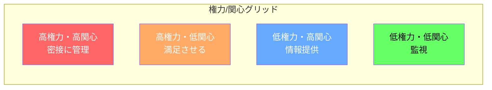
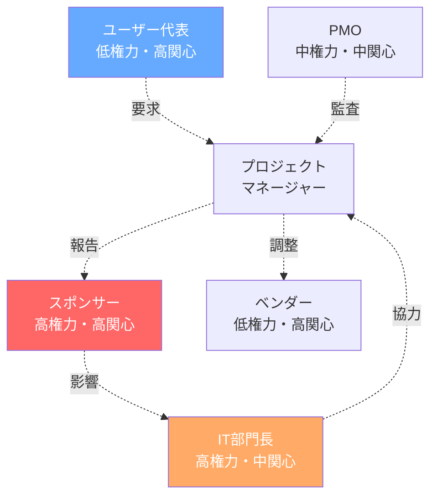

# ステークホルダー登録簿

> **重要**: ステークホルダーマネジメントは「人」の管理です。期待値をコントロールし、エンゲージメントを高めることが成功の鍵！

## 文書情報

| 項目           | 内容             |
| -------------- | ---------------- |
| プロジェクト名 | [プロジェクト名] |
| 作成日         | [YYYY/MM/DD]     |
| 最終更新日     | [YYYY/MM/DD]     |
| 機密レベル     | 高（限定配布）   |

> ⚠️ **注意**: この文書には個人の評価が含まれるため、配布は最小限に留めてください

---

## ステークホルダー分析マトリックス

---

## ステークホルダー登録簿

| ID   | 氏名/組織 | 役職/役割              | 部門    | 権力 | 関心 | 影響力 | 現在の態度 | 望ましい態度   | 分類 | 主な期待事項       | 懸念事項     | 連絡先        |
| ---- | --------- | ---------------------- | ------- | ---- | ---- | ------ | ---------- | -------------- | ---- | ------------------ | ------------ | ------------- |
| S001 | [氏名]    | プロジェクトスポンサー | 経営層  | 高   | 高   | 高     | 支援的     | 支援的（維持） | 内部 | ROI 達成、期限厳守 | 予算超過     | [メール/電話] |
| S002 | [氏名]    | 部門長                 | IT 部門 | 高   | 中   | 高     | 中立       | 支援的         | 内部 | システム安定性     | リソース負荷 | [連絡先]      |
| S003 | [氏名]    | エンドユーザー代表     | 営業部  | 低   | 高   | 中     | 懸念       | 支援的         | 内部 | 使いやすさ         | 業務の変化   | [連絡先]      |
| S004 | [会社名]  | ベンダー               | -       | 低   | 高   | 中     | 支援的     | 支援的（維持） | 外部 | 継続的な取引       | 仕様変更     | [連絡先]      |
| S005 | [氏名]    | PMO                    | PMO     | 中   | 中   | 中     | 支援的     | 支援的（維持） | 内部 | 標準プロセス準拠   | 文書不備     | [連絡先]      |

### 評価基準

**権力レベル**

- 高: プロジェクトを中止できる権限を持つ
- 中: プロジェクトに大きな変更を加えられる
- 低: 限定的な影響力のみ

**関心レベル**

- 高: プロジェクトの成否が直接影響する
- 中: 間接的に影響を受ける
- 低: ほとんど影響を受けない

**現在の態度**

- 支援的: 積極的にサポート
- 中立: 特に意見なし
- 懸念: 不安や疑問を持っている
- 抵抗的: 反対している

---

## ステークホルダー詳細分析（主要ステークホルダーのみ）

### S001: [スポンサー名]

**プロフィール:**

- 背景: [経歴、専門分野]
- 意思決定スタイル: [データ重視/直感型等]
- コミュニケーション選好: [メール/対面/電話]

**プロジェクトへの期待:**

1. [期待 1]
2. [期待 2]
3. [期待 3]

**潜在的な懸念:**

1. [懸念 1]
2. [懸念 2]

**エンゲージメント戦略:**

- 定期報告: [頻度と形式]
- 重要な意思決定への関与: [タイミング]
- 成功の可視化: [方法]

**影響力の及ぶ範囲:**

- [影響範囲 1]
- [影響範囲 2]

---

## ステークホルダーエンゲージメント計画

### エンゲージメントレベル

| ステークホルダー | 現在   | 望ましい | ギャップ | アクション                 |
| ---------------- | ------ | -------- | -------- | -------------------------- |
| S001             | 支援的 | 支援的   | なし     | 現状維持、定期的な成功報告 |
| S002             | 中立   | 支援的   | あり     | 個別面談、便益の説明       |
| S003             | 懸念   | 支援的   | 大きい   | トレーニング計画、デモ実施 |

### エンゲージメント評価基準

- **不認識**: プロジェクトを知らない
- **抵抗的**: プロジェクトに反対
- **中立**: どちらでもない
- **支援的**: プロジェクトを支援
- **主導的**: 積極的に推進

---

## コミュニケーション計画

| ステークホルダー  | 情報ニーズ         | 頻度 | 方法           | 責任者       | テンプレート |
| ----------------- | ------------------ | ---- | -------------- | ------------ | ------------ |
| S001 スポンサー   | 進捗、課題、予算   | 週次 | 対面会議       | PM           | 経営報告書   |
| S002 部門長       | リソース状況       | 隔週 | メール         | PM           | 状況報告書   |
| S003 ユーザー代表 | 機能説明、変更     | 月次 | ワークショップ | BA           | デモ資料     |
| S004 ベンダー     | 仕様、スケジュール | 随時 | 会議/メール    | 技術リーダー | 仕様書       |

---

## ステークホルダー関係図

---

## 政治的配慮事項（機密）

> ⚠️ この項目は特に機密性が高いため、取り扱いに注意

### 力関係

- [ステークホルダー間の力関係]
- [派閥や対立関係]

### 隠れたアジェンダ

- [表面化していない期待や要求]
- [個人的な利害関係]

### 要注意事項

- [地雷となりうるトピック]
- [避けるべき話題や行動]

---

## ステークホルダー管理のヒント

### やるべきこと ✅

1. **定期的な更新**: 最低でも月 1 回は見直し
2. **1 対 1 の時間**: 主要ステークホルダーとの個別面談
3. **期待値管理**: 早めに非現実的な期待を修正
4. **成功の共有**: 小さな成功も積極的に共有
5. **非公式コミュニケーション**: 廊下での立ち話も重要

### 避けるべきこと ❌

1. **驚かせない**: バッドニュースは早めに共有
2. **無視しない**: 低権力でも高関心の人を軽視しない
3. **過度の約束**: できないことは約束しない
4. **一方的な連絡**: 双方向のコミュニケーション
5. **感情を軽視**: 論理だけでなく感情も考慮

### エスカレーション基準

- ステークホルダーが「抵抗的」に変化した場合
- 重要な期待値のずれが発見された場合
- ステークホルダー間で対立が発生した場合

---

### 更新履歴

| 日付         | 更新内容                       | 更新者 |
| ------------ | ------------------------------ | ------ |
| [YYYY/MM/DD] | 初版作成                       | [氏名] |
| [YYYY/MM/DD] | S003 の態度が懸念 → 中立に改善 | [氏名] |
