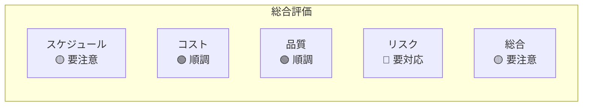
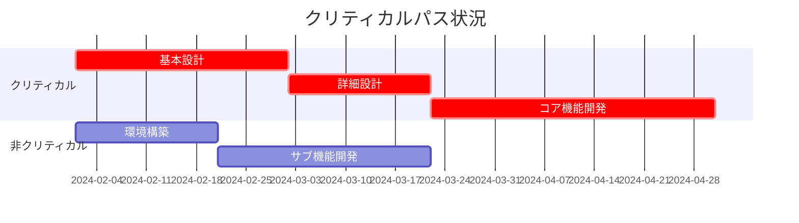
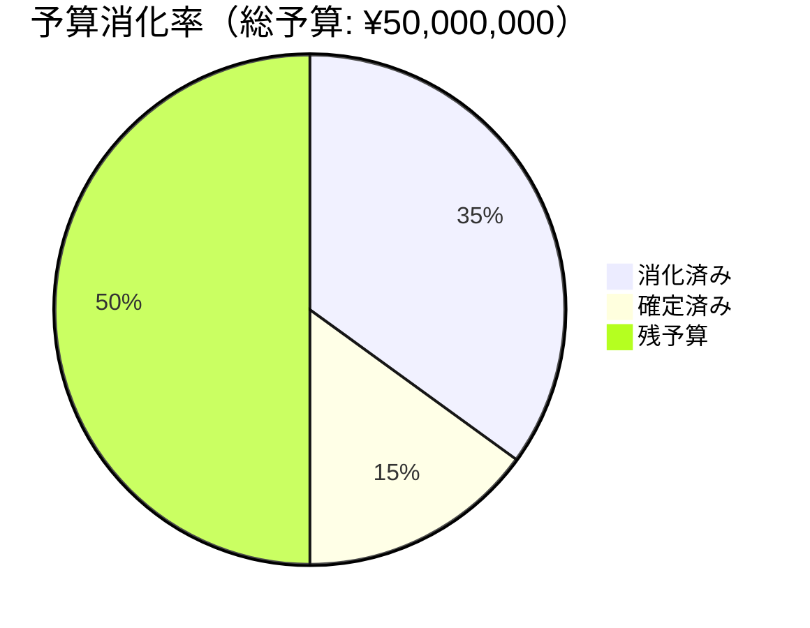

# 作業パフォーマンスレポート

> **重要**: このレポートは「過去・現在・未来」を伝える文書です。データだけでなく、洞察と推奨アクションを含めてください。

## レポート情報

| 項目 | 内容 |
|------|------|
| プロジェクト名 | [プロジェクト名] |
| レポート期間 | [YYYY/MM/DD] 〜 [YYYY/MM/DD] |
| レポート作成日 | [YYYY/MM/DD] |
| 作成者 | [氏名] |
| 配布先 | [配布リスト] |

---

## 1. エグゼクティブサマリー

### プロジェクト健全性



### キーメッセージ（3行以内）
1. [最も重要なメッセージ]
2. [2番目に重要なメッセージ]
3. [3番目に重要なメッセージ]

### 必要なアクション
- [ ] [経営層の意思決定が必要な事項]
- [ ] [承認が必要な事項]
- [ ] [エスカレーションが必要な事項]

---

## 2. スケジュール状況

### マイルストーン進捗

| マイルストーン | 計画日 | 予測日 | 差異 | ステータス | 備考 |
|--------------|--------|--------|------|-----------|------|
| 要件定義完了 | 2024/01/31 | 2024/01/31 | 0日 | ✅ 完了 | |
| 設計完了 | 2024/03/15 | 2024/03/22 | +7日 | 🟡 遅延リスク | 要員不足による |
| 開発完了 | 2024/05/31 | 2024/06/07 | +7日 | 🔴 要対応 | |
| 本番リリース | 2024/06/30 | 2024/07/07 | +7日 | 🔴 要対応 | |

### クリティカルパス分析


### スケジュール指標（EVM）
| 指標 | 値 | 評価 |
|------|-----|------|
| SV (スケジュール差異) | -¥2,000,000 | 遅延傾向 |
| SPI (スケジュール効率指数) | 0.92 | 8%の遅れ |
| 完了予測日 | 2024/07/07 | 7日遅延見込み |

---

## 3. コスト状況

### 予算消化状況



### コスト指標（EVM）

| 指標 | 計画値(PV) | 実績値(EV) | 実コスト(AC) | 差異 |
|------|-----------|-----------|-------------|------|
| 累計 | ¥20,000,000 | ¥18,000,000 | ¥17,500,000 | |
| CV (コスト差異) | - | - | - | +¥500,000 |
| CPI (コスト効率指数) | - | - | - | 1.03 |
| EAC (完了時総コスト予測) | ¥50,000,000 | - | - | ¥48,500,000 |

### コスト内訳と予測

| 費目 | 予算 | 実績 | 予測 | 差異 |
|------|------|------|------|------|
| 人件費 | ¥30,000,000 | ¥12,000,000 | ¥29,000,000 | -¥1,000,000 |
| 外注費 | ¥15,000,000 | ¥5,000,000 | ¥15,500,000 | +¥500,000 |
| その他 | ¥5,000,000 | ¥500,000 | ¥4,000,000 | -¥1,000,000 |
| **合計** | **¥50,000,000** | **¥17,500,000** | **¥48,500,000** | **-¥1,500,000** |

---

## 4. 品質状況

### 品質メトリクス

| メトリクス | 目標値 | 実績値 | 評価 |
|-----------|--------|--------|------|
| 欠陥密度 | <5件/KLOC | 3.2件/KLOC | 🟢 達成 |
| コードカバレッジ | >80% | 85% | 🟢 達成 |
| レビュー指摘事項 | - | 152件 | - |
| 顧客満足度 | >4.0 | 4.2 | 🟢 達成 |

### 欠陥の傾向

```mermaid
line title 欠陥の発見・解決状況
    x-axis ["第1週", "第2週", "第3週", "第4週"]
    y-axis "件数" 0 --> 50
    line "新規発見" [10, 25, 35, 20]
    line "解決済み" [5, 20, 30, 25]
    line "未解決累計" [5, 10, 15, 10]
```

---

## 5. リスク状況

### トップ5リスク

| 順位 | リスク | スコア | 前週比 | 対応状況 |
|------|--------|--------|--------|----------|
| 1 | キーメンバーの離脱可能性 | 20 | ↑ | 代替要員の確保を検討中 |
| 2 | 外部API仕様変更 | 16 | → | ベンダーと調整中 |
| 3 | パフォーマンス要件未達 | 15 | ↓ | チューニング実施中 |
| 4 | セキュリティ脆弱性 | 12 | NEW | 診断実施予定 |
| 5 | ユーザー受入の遅れ | 9 | → | トレーニング計画策定 |

### リスク対応の進捗
- 完了: 2件
- 実施中: 5件  
- 未着手: 3件
- 新規識別: 1件

---

## 6. 主要な成果と課題

### 今週の成果
1. ✅ [成果1]
2. ✅ [成果2]
3. ✅ [成果3]

### 直面している課題

| 課題 | 影響 | 対応案 | 必要なサポート | 期限 |
|------|------|--------|---------------|------|
| [課題1] | 高 | [対応案] | [サポート内容] | [日付] |
| [課題2] | 中 | [対応案] | [サポート内容] | [日付] |

---

## 7. 今後2週間の予定

### 主要アクティビティ
1. [アクティビティ1]
2. [アクティビティ2]
3. [アクティビティ3]

### 重要な意思決定ポイント
- [日付]: [意思決定事項]
- [日付]: [意思決定事項]

---

## 8. 推奨事項とアクションアイテム

### 推奨事項
1. **[推奨事項1]**
   - 理由: [詳細な理由]
   - 期待効果: [効果]

2. **[推奨事項2]**
   - 理由: [詳細な理由]
   - 期待効果: [効果]

### アクションアイテム

| No | アクション | 責任者 | 期限 | ステータス |
|----|-----------|--------|------|-----------|
| 1 | [アクション1] | [氏名] | [日付] | 未着手 |
| 2 | [アクション2] | [氏名] | [日付] | 進行中 |
| 3 | [アクション3] | [氏名] | [日付] | 未着手 |

---

## 9. 添付資料

1. 詳細スケジュール（ガントチャート）
2. EVM詳細分析
3. リスク登録簿（最新版）
4. 変更要求一覧
5. テスト結果詳細

---

## レポート作成のベストプラクティス

### 効果的なレポートのポイント
1. **結論を先に**: エグゼクティブサマリーで全てが分かるように
2. **視覚化**: グラフや図表で理解しやすく
3. **アクション指向**: 問題の報告だけでなく、解決策も提示
4. **定量的**: 可能な限り数値で示す
5. **一貫性**: 毎回同じフォーマットで比較しやすく

### 避けるべきこと
- 専門用語の羅列
- 言い訳や責任転嫁
- 楽観的すぎる見通し
- 重要な問題の隠蔽